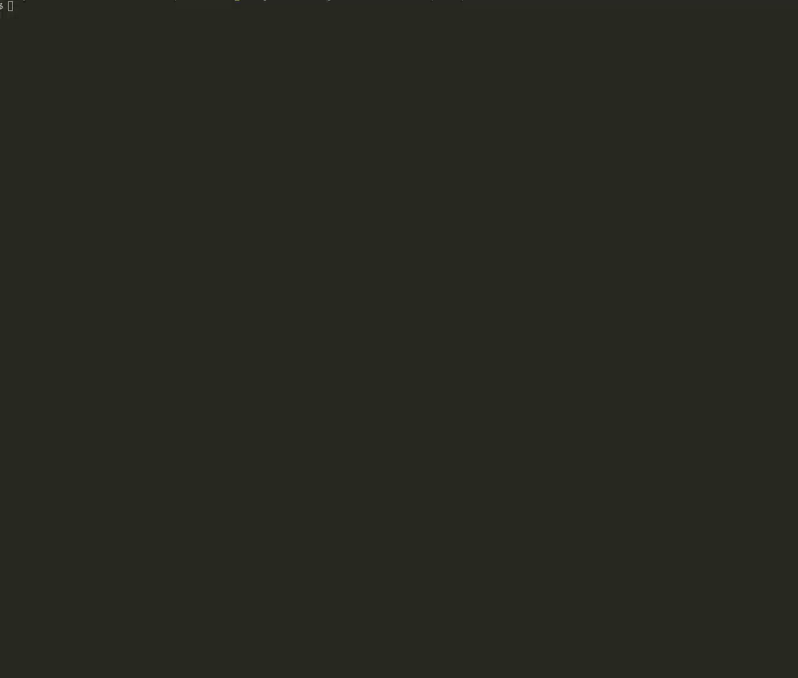

## Command Line Guess
This project is a classic word guessing game in command line form. The application uses node to generate random words and allows user to guess the word provided. The application begins by providing a representation of the word using underscores (Ex '_ _ _ _ _'), which are replaced once a user guesses a letter correctly. The amount of guesses is equal to double the length of each word, and if they are all used then a loss is incurred. The game also tracks wins/losses and letters previously used. 

## Motivation
I made this application in order to utilize javascript outside of a browser. Thus, I was able to continue progressing on javascript and learn how to utilize node. This will be especially important on projects that use node (and express) to create servers for full - stack applications. 

## Resolutions
During development the application was difficult to build when all the functionality was held in one file. After reading some documentation I learned that Node has a 'file system' package that enables one file to read/write to another. This allowed to separate my code into components and modules, making it much easier to build.

## Installation

If you want to test this out for yourself, Just use these simple steps!

1. Fork the repository and clone it to your local machine. 
2. Make sure node is installed. 
3. Open the terminal in our project directory and run the command 'npm install'
4. Enter 'Node index' in the terminal and then follow the commands!

## Screenshots

  
## Technology
* Javascript (ES6) 
* Node.js [Download](https://nodejs.org/en/download/)

